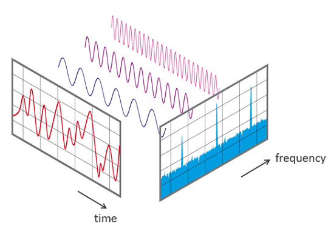

# Fourier Transform and FFT Visualizer

 
 Demonstration of Fourier and Fast Fourier Transform over several different signals.

 ## App Includes:

 * Fourier Series Visualization

 * Fast Fourier Transform Visualization

### Classification Models:

#### * Fourier Transform Visualization

A Fourier transform is a mathematical transform that decomposes functions depending on space or time into functions depending on spatial frequency or temporal frequency. An example application would be decomposing the waveform of a musical chord into terms of the intensity of its constituent pitches.

Coefficients of Fourier Transform:

#### * Visualizations:

Visualization of the Fourier Transform over Saw-Tooth, Square and other signals are demonstrated in the application. 

Reference images:

#### * Fast Fourier Transform

A fast Fourier transform is an algorithm that computes the discrete Fourier transform of a sequence, or its inverse. Fourier analysis converts a signal from its original domain to a representation in the frequency domain and vice versa.

#### * Visualizations:

Visualization of the Fourier Transform over Sine, Square and other signals are demonstrated in the application. 

Reference images:

